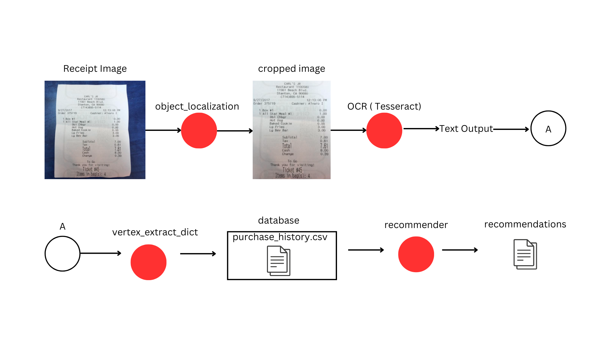

# Takasimura | Receipt OCR & Product Recommendations
## Group ID : C242-PR589
## Machine Learning Team Member
| Student ID   | Name                     | University                         |
|--------------|--------------------------|------------------------------------|
| M318B4KY0501 | Andi Muh.Rakha Makkawaru | Universitas Sultan Ageng Tirtayasa |
| M200B4KY2787 | Muhammad Dzaki Al Aqsha  | Universitas Diponegoro             |
## Machine Learning Overview
This project aims to develop a system that leverages computer vision and other machine learning techniques to analyze physical receipts and provide personalized product recommendations. By processing images of receipts, extracting relevant information, and applying recommendation algorithms, the system can suggest similar products at lower prices and closer locations to the user's current location.

The machine learning process of the project follows a logic denoted by this architecture diagram:

